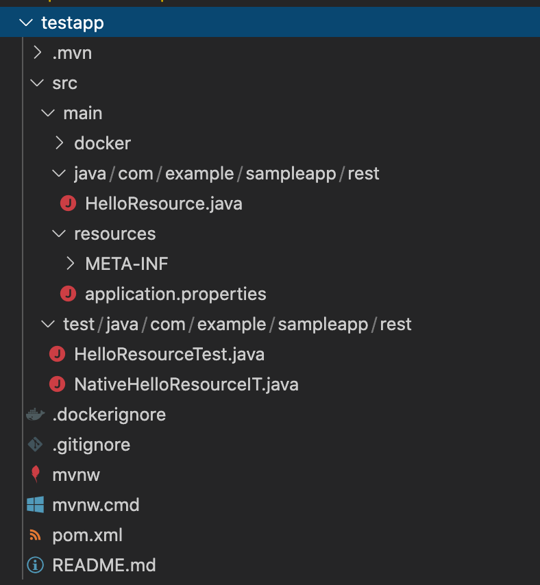

# API Test Automation Tutorial

REST APIのテスト自動化のチュートリアルです。

## 前提環境

- OpenJDK11 (or 8)
- Apache Maven

## プロジェクトの作成

```
$ mvn io.quarkus:quarkus-maven-plugin:1.7.5.Final-redhat-00011:create \
    -DprojectGroupId=com.example \
    -DprojectArtifactId=testapp \
    -DplatformGroupId=com.redhat.quarkus \
    -DplatformVersion=1.7.5.Final-redhat-00011 \
    -DclassName=com.example.sampleapp.rest.HelloResource

...
[INFO] ------------------------------------------------------------------------
[INFO] BUILD SUCCESS
[INFO] ------------------------------------------------------------------------
[INFO] Total time:  11.366 s
[INFO] Finished at: 2020-12-24T16:27:30+09:00
[INFO] ------------------------------------------------------------------------
```



pom.xmlには以下のような依存関係が定義されています。
デフォルトでQuarkusのテスト支援機能やREST-Assuredが入っています。

```
 <dependencies>
    <dependency>
      <groupId>io.quarkus</groupId>
      <artifactId>quarkus-resteasy</artifactId>
    </dependency>
    <dependency>
      <groupId>io.quarkus</groupId>
      <artifactId>quarkus-junit5</artifactId>
      <scope>test</scope>
    </dependency>
    <dependency>
      <groupId>io.rest-assured</groupId>
      <artifactId>rest-assured</artifactId>
      <scope>test</scope>
    </dependency>
  </dependencies>
```

## 実行確認
サンプルアプリのソースコードです。

```java
package com.example.sampleapp.rest;

import javax.ws.rs.GET;
import javax.ws.rs.Path;
import javax.ws.rs.Produces;
import javax.ws.rs.core.MediaType;

@Path("/hello")
public class HelloResource {

    @GET
    @Produces(MediaType.TEXT_PLAIN)
    public String hello() {
        return "hello";
    }
}
```

テストケースはこちらです。REST-Assuredベースの書き方になっています。
```java
package com.example.sampleapp.rest;

import io.quarkus.test.junit.QuarkusTest;
import org.junit.jupiter.api.Test;

import static io.restassured.RestAssured.given;
import static org.hamcrest.CoreMatchers.is;

@QuarkusTest
public class HelloResourceTest {

    @Test
    public void testHelloEndpoint() {
        given()
          .when().get("/hello")
          .then()
             .statusCode(200)
             .body(is("hello"));
    }

}
```


デフォルトで用意されたテストを実行します。

```txt
% cd testapp 
% mvn clean verify
[INFO] Scanning for projects...
[INFO] 
[INFO] ------------------------< com.example:testapp >-------------------------
[INFO] Building testapp 1.0-SNAPSHOT
[INFO] --------------------------------[ jar ]---------------------------------
[INFO] 
[INFO] --- maven-clean-plugin:2.5:clean (default-clean) @ testapp ---
[INFO] 
[INFO] --- quarkus-maven-plugin:1.7.5.Final-redhat-00011:generate-code (default) @ testapp ---
[INFO] 
[INFO] --- maven-resources-plugin:2.6:resources (default-resources) @ testapp ---
[INFO] Using 'UTF-8' encoding to copy filtered resources.
[INFO] Copying 2 resources
[INFO] 
[INFO] --- maven-compiler-plugin:3.8.1:compile (default-compile) @ testapp ---
[INFO] Changes detected - recompiling the module!
[INFO] Compiling 1 source file to /Users/nkoike/trial/quarkus/rhboq/testapp/target/classes
[INFO] 
[INFO] --- quarkus-maven-plugin:1.7.5.Final-redhat-00011:generate-code-tests (default) @ testapp ---
[INFO] 
[INFO] --- maven-resources-plugin:2.6:testResources (default-testResources) @ testapp ---
[INFO] Using 'UTF-8' encoding to copy filtered resources.
[INFO] skip non existing resourceDirectory /Users/nkoike/trial/quarkus/rhboq/testapp/src/test/resources
[INFO] 
[INFO] --- maven-compiler-plugin:3.8.1:testCompile (default-testCompile) @ testapp ---
[INFO] Changes detected - recompiling the module!
[INFO] Compiling 2 source files to /Users/nkoike/trial/quarkus/rhboq/testapp/target/test-classes
[INFO] 
[INFO] --- maven-surefire-plugin:3.0.0-M5:test (default-test) @ testapp ---
[INFO] 
[INFO] -------------------------------------------------------
[INFO]  T E S T S
[INFO] -------------------------------------------------------
[INFO] Running com.example.sampleapp.rest.HelloResourceTest
2020-12-24 16:59:56,844 INFO  [io.quarkus] (main) Quarkus 1.7.5.Final-redhat-00011 on JVM started in 1.295s. Listening on: http://0.0.0.0:8081
2020-12-24 16:59:56,845 INFO  [io.quarkus] (main) Profile test activated. 
2020-12-24 16:59:56,845 INFO  [io.quarkus] (main) Installed features: [cdi, resteasy]
[INFO] Tests run: 1, Failures: 0, Erro**rs: 0, Skipped: 0, Time elapsed: 3.824 s - in com.example.sampleapp.rest.HelloResourceTest
2020-12-24 16:59:57,958 INFO  [io.quarkus] (main) Q**uarkus stopped in 0.020s
[INFO] 
[INFO] Results:
[INFO] 
[INFO] Tests run: 1, Failures: 0, Errors: 0, Skipped: 0
[INFO] 
[INFO] 
[INFO] --- maven-jar-plugin:2.4:jar (default-jar) @ testapp ---
[INFO] Building jar: /Users/nkoike/trial/quarkus/rhboq/testapp/target/testapp-1.0-SNAPSHOT.jar
[INFO] 
[INFO] --- quarkus-maven-plugin:1.7.5.Final-redhat-00011:build (default) @ testapp ---
[INFO] [org.jboss.threads] JBoss Threads version 3.1.1.Final-redhat-00001
[INFO] [io.quarkus.deployment.pkg.steps.JarResultBuildStep] Building thin jar: /Users/nkoike/trial/quarkus/rhboq/testapp/target/testapp-1.0-SNAPSHOT-runner.jar
[INFO] [io.quarkus.deployment.QuarkusAugmentor] Quarkus augmentation completed in 946ms
[INFO] ------------------------------------------------------------------------
[INFO] BUILD SUCCESS
[INFO] ------------------------------------------------------------------------
[INFO] Total time:  9.283 s
[INFO] Finished at: 2020-12-24T16:59:59+09:00
[INFO] ------------------------------------------------------------------------
```

Quarkusアプリ（API）がテスト時に起動し、テストが実施されました。

## REST-Assuredによるテスト

### テストケースの作成

割愛します


## Quarkusアプリケーションのテスト

### サンプルアプリへの機能追加

JSON-B Extensionを追加
```
$ mvn quarkus:add-extensions -Dextensions="resteasy-jsonb"  
```

メソッドを追加
```java
    @GET
    @Path("/json")
    @Produces(MediaType.APPLICATION_JSON)
    public Map<String,Object> helloJson() {
        
        Map<String,Object> res = new HashMap<>();
        res.put("name","Yamada");
        res.put("age","20");
        res.put("birthdate","2000/12/25");

        return res;
    }
```
以下のJSONを返します
```
$ curl http://localhost:8080/hello/json
{"birthdate":"2000/12/25","name":"Yamada","age":"20"}
```
### テストの修正

HelloResourceTestには以下を追加
```java
    @Test
    public void testJson() {
      given()
        .when().get("/hello/json")
        .then()
          .log().all()
          .assertThat()
          .body(containsString("Yamada"));

    }
```
以下のimport文も追加しておきます。
```java
import static org.hamcrest.Matchers.*;
```
テストを実行
```
$ mvn test
...
[INFO] -------------------------------------------------------
[INFO]  T E S T S
[INFO] -------------------------------------------------------
[INFO] Running com.example.sampleapp.rest.HelloResourceTest
2020-12-25 23:38:50,411 INFO  [io.quarkus] (main) Quarkus 1.7.5.Final-redhat-00011 on JVM started in 2.767s. Listening on: http://0.0.0.0:8081
2020-12-25 23:38:50,411 INFO  [io.quarkus] (main) Profile test activated.
2020-12-25 23:38:50,411 INFO  [io.quarkus] (main) Installed features: [cdi, resteasy, resteasy-jsonb]
HTTP/1.1 200 OK
Content-Length: 53
Content-Type: application/json

{
    "birthdate": "2000/12/25",
    "name": "Yamada",
    "age": "20"
}
[INFO] Tests run: 2, Failures: 0, Errors: 0, Skipped: 0, Time elapsed: 5.553 s - in com.example.sampleapp.rest.HelloResourceTest
2020-12-25 23:38:52,567 INFO  [io.quarkus] (main) Quarkus stopped in 0.041s
[INFO] 
[INFO] Results:
[INFO]
[INFO] Tests run: 2, Failures: 0, Errors: 0, Skipped: 0
[INFO]
[INFO] ------------------------------------------------------------------------
[INFO] BUILD SUCCESS
[INFO] ------------------------------------------------------------------------
[INFO] Total time:  12.024 s
[INFO] Finished at: 2020-12-25T23:38:52+09:00
[INFO] ------------------------------------------------------------------------
```
追加したテストも成功。
レスポンスの内容も出力されています。

次は以下のテストを追加。
JSONをParseしてプロパティの値をAssertします。
```java
   @Test
    public void testJson2() {
      given()
        .when().get("/hello/json")
        .then()
          .log().body()
          .assertThat()
          .body("age",equalTo("20"));

    }

```
今度はレスポンスのbodyを出力して成功。
```
$ mvn test
...
[INFO] -------------------------------------------------------
[INFO]  T E S T S
[INFO] -------------------------------------------------------
[INFO] Running com.example.sampleapp.rest.HelloResourceTest
2020-12-25 23:59:38,885 INFO  [io.quarkus] (main) Quarkus 1.7.5.Final-redhat-00011 on JVM started in 2.693s. Listening on: http://0.0.0.0:8081
2020-12-25 23:59:38,887 INFO  [io.quarkus] (main) Profile test activated.
2020-12-25 23:59:38,887 INFO  [io.quarkus] (main) Installed features: [cdi, resteasy, resteasy-jsonb]
{
    "birthdate": "2000/12/25",
    "name": "Yamada",
    "age": "20"
}
HTTP/1.1 200 OK
Content-Length: 53
Content-Type: application/json

{
    "birthdate": "2000/12/25",
    "name": "Yamada",
    "age": "20"
}
[INFO] Tests run: 3, Failures: 0, Errors: 0, Skipped: 0, Time elapsed: 5.752 s - in com.example.sampleapp.rest.HelloResourceTest
2020-12-25 23:59:41,357 INFO  [io.quarkus] (main) Quarkus stopped in 0.036s
[INFO] 
[INFO] Results:
[INFO]
[INFO] Tests run: 3, Failures: 0, Errors: 0, Skipped: 0
[INFO]
[INFO] ------------------------------------------------------------------------
[INFO] BUILD SUCCESS
[INFO] ------------------------------------------------------------------------
[INFO] Total time:  11.370 s
[INFO] Finished at: 2020-12-25T23:59:41+09:00
[INFO] ------------------------------------------------------------------------
```
次は以下のテストを追加。
複数項目の検証を行います。
```java
@Test
    public void testJson3() {
      given()
        .when().get("/hello/json")
        .then()
          .log().body()
          .assertThat()
          .body("birthdate",not(empty()))
          .body("name", equalToIgnoringCase("yamada"))
          .body("gender",nullValue())
          .body("age",lessThan(30));

    }
```
成功しました。
```
$ mvn test
...
[INFO] -------------------------------------------------------
[INFO]  T E S T S
[INFO] -------------------------------------------------------
[INFO] Running com.example.sampleapp.rest.HelloResourceTest
2020-12-26 00:24:37,874 INFO  [io.quarkus] (main) Quarkus 1.7.5.Final-redhat-00011 on JVM started in 2.215s. Listening on: http://0.0.0.0:8081
2020-12-26 00:24:37,876 INFO  [io.quarkus] (main) Profile test activated. 
2020-12-26 00:24:37,876 INFO  [io.quarkus] (main) Installed features: [cdi, resteasy, resteasy-jsonb]
{
    "birthdate": "2000/12/25",
    "name": "Yamada",
    "age": 20
}
{
    "birthdate": "2000/12/25",
    "name": "Yamada",
    "age": 20
}
HTTP/1.1 200 OK
Content-Length: 51
Content-Type: application/json

{
    "birthdate": "2000/12/25",
    "name": "Yamada",
    "age": 20
}
[INFO] Tests run: 4, Failures: 0, Errors: 0, Skipped: 0, Time elapsed: 4.846 s - in com.example.sampleapp.rest.HelloResourceTest
2020-12-26 00:24:40,039 INFO  [io.quarkus] (main) Quarkus stopped in 0.038s
[INFO] 
[INFO] Results:
[INFO]
[INFO] Tests run: 4, Failures: 0, Errors: 0, Skipped: 0
[INFO]
[INFO] ------------------------------------------------------------------------
[INFO] BUILD SUCCESS
[INFO] ------------------------------------------------------------------------
[INFO] Total time:  10.300 s
[INFO] Finished at: 2020-12-26T00:24:40+09:00
[INFO] ------------------------------------------------------------------------
```
ステータスコードを扱うテストは以下のように。
```java
    @Test
    public void testJson404() {
      given()
        .when().get("/hello/404")
        .then()
          .statusCode(405)
          .log().all();
    }
```

```
$ mvn test
...
[INFO] -------------------------------------------------------
[INFO]  T E S T S
[INFO] -------------------------------------------------------
[INFO] Running com.example.sampleapp.rest.HelloResourceTest
2020-12-26 00:31:58,597 INFO  [io.quarkus] (main) Quarkus 1.7.5.Final-redhat-00011 on JVM started in 2.222s. Listening on: http://0.0.0.0:8081
2020-12-26 00:31:58,600 INFO  [io.quarkus] (main) Profile test activated.
2020-12-26 00:31:58,600 INFO  [io.quarkus] (main) Installed features: [cdi, resteasy, resteasy-jsonb]
HTTP/1.1 404 Not Found
Content-Length: 86
Content-Type: text/html;charset=UTF-8

<html>
  <body>RESTEASY003210: Could not find resource for full path: http://localhost:8081/hello/404</body>
</html>
{
    "birthdate": "2000/12/25",
    "name": "Yamada",
    "age": 20
}
{
    "birthdate": "2000/12/25",
    "name": "Yamada",
    "age": 20
}
HTTP/1.1 200 OK
Content-Length: 51
Content-Type: application/json

{
    "birthdate": "2000/12/25",
    "name": "Yamada",
    "age": 20
}
[INFO] Tests run: 5, Failures: 0, Errors: 0, Skipped: 0, Time elapsed: 5.092 s - in com.example.sampleapp.rest.HelloResourceTest
2020-12-26 00:32:00,993 INFO  [io.quarkus] (main) Quarkus stopped in 0.057s
[INFO] 
[INFO] Results:
[INFO]
[INFO] Tests run: 5, Failures: 0, Errors: 0, Skipped: 0
[INFO]
[INFO] ------------------------------------------------------------------------
[INFO] BUILD SUCCESS
[INFO] ------------------------------------------------------------------------
[INFO] Total time:  10.617 s
[INFO] Finished at: 2020-12-26T00:32:01+09:00
[INFO] ------------------------------------------------------------------------
```