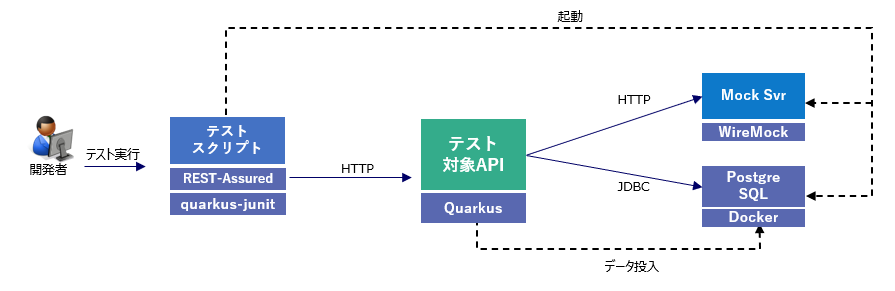

# API Test Automation Tutorial with Quarkus

REST APIのテスト自動化のチュートリアルです。

このチュートリアルでは、以下を通してQuarkusで実装するREST APIのテストを自動化する方法について学習します。
- [プロジェクトの作成](#プロジェクトの作成)
- [基本的なQuarkusアプリケーションのテスト](#基本的なQuarkusアプリケーションのテスト)
- [DBを使用するQuarkusアプリケーションのテスト](#DBを使用するQuarkusアプリケーションのテスト)
- [外部APIを使用するQuarkusアプリケーションのテスト](#外部APIを呼び出すQuarkusアプリケーションのテスト)
- [テスト用リソースのセットアップ自動化](#自動化のためのテスト用リソースのセットアップ)
- [パイプラインでのAPIテスト自動化](#パイプラインでのAPIテスト自動化)

## 前提環境

- OpenJDK11 
- Apache Maven 3.6.3
- Docker

## プロジェクトの作成

Quarkusにおける通常の方法でMavenプロジェクトを作成します。  
（当リポジトリをCloneして利用する場合はSkipして構いません）

```
$ mvn io.quarkus:quarkus-maven-plugin:1.7.5.Final-redhat-00011:create \
    -DprojectGroupId=com.example \
    -DprojectArtifactId=testapp \
    -DplatformGroupId=com.redhat.quarkus \
    -DplatformVersion=1.7.5.Final-redhat-00011 \
    -DclassName=com.example.sampleapp.rest.HelloResource

...
[INFO] ------------------------------------------------------------------------
[INFO] BUILD SUCCESS
[INFO] ------------------------------------------------------------------------
...
```
以下のような構造のプロジェクトが作成されます。

```
\TESTAPP
├─.mvn
│  └─wrapper
├─.settings
└─src
    ├─main
    │  ├─docker
    │  ├─java
    │  │  └─com
    │  │      └─example
    │  │          └─sampleapp
    │  │              └─rest
    │  └─resources
    │      └─META-INF
    │          └─resources
    └─test
        └─java
            └─com
                └─example
                    └─sampleapp
                        └─rest
```

pom.xmlには以下のような依存関係が定義されています。  
デフォルトでQuarkusのJUnit拡張機能やREST-Assuredが入っています。
```
...
 <dependencies>
    <dependency>
      <groupId>io.quarkus</groupId>
      <artifactId>quarkus-resteasy</artifactId>
    </dependency>
    <dependency>
      <groupId>io.quarkus</groupId>
      <artifactId>quarkus-junit5</artifactId>
      <scope>test</scope>
    </dependency>
    <dependency>
      <groupId>io.rest-assured</groupId>
      <artifactId>rest-assured</artifactId>
      <scope>test</scope>
    </dependency>
  </dependencies>
  ...
```
quarkus-junit5はテストフレームワークを制御する@QuarkusTestアノテーションを提供しているので、テストに必要です。REST-Assuredは必須ではありませんが、HTTPエンドポイントをテストする際、Quarkusとの統合によりエンドポイントURLを自動設定する機能を提供します。

## 実行確認

プロジェクト内に生成されるサンプルアプリ（API）のソースコードです。

```java
package com.example.sampleapp.rest;

import javax.ws.rs.GET;
import javax.ws.rs.Path;
import javax.ws.rs.Produces;
import javax.ws.rs.core.MediaType;

@Path("/hello")
public class HelloResource {

    @GET
    @Produces(MediaType.TEXT_PLAIN)
    public String hello() {
        return "hello";
    }
}
```

テストケースも生成されます。REST-Assuredベースのスクリプトになっています。
```java
package com.example.sampleapp.rest;

import io.quarkus.test.junit.QuarkusTest;
import org.junit.jupiter.api.Test;

import static io.restassured.RestAssured.given;
import static org.hamcrest.CoreMatchers.is;

@QuarkusTest
public class HelloResourceTest {

    @Test
    public void testHelloEndpoint() {
        given()
          .when().get("/hello")
          .then()
             .statusCode(200)
             .body(is("hello"));
    }

}
```
RREST-Assuredは、Rest APIテストの自動化を可能にするJavaライブラリであり、Javaベースのため学習にはコアJavaの知識があれば十分です。  
テスト時にREST APIのリクエストとレスポンスの値を取得したり、APIへのリクエストにヘッダー、クエリ、パスパラメータ、任意のセッションやクッキーを設定してカスタマイズすることができます。
Assert文や条件を設定するのも容易に行えます。  

REST-Assuredで使用する主なメソッドです。
- given : テストの開始時に呼び出し、リクエストのデフォルト設定を適用します。
- when : テストの条件を記述します。HTTPメソッドやパラメータ等の設定を実施します。
- then : テストの想定結果を記述します。記述にはHamcrestライブラリの柔軟なMatcherを使用できます。

REST-Assuredについて詳しくは以下を参照ください。
- [Usage · rest-assured/rest-assured Wiki](https://github.com/rest-assured/rest-assured/wiki/Usage)


デフォルトで用意されたテストを実行します。

```txt
$ cd testapp 
$ mvn clean verify
[INFO] Scanning for projects...
[INFO] 
[INFO] ------------------------< com.example:testapp >-------------------------
[INFO] Building testapp 1.0-SNAPSHOT
...
[INFO] 
[INFO] -------------------------------------------------------
[INFO]  T E S T S
[INFO] -------------------------------------------------------
[INFO] Running com.example.sampleapp.rest.HelloResourceTest
2020-12-24 16:59:56,844 INFO  [io.quarkus] (main) Quarkus 1.7.5.Final-redhat-00011 on JVM started in 1.295s. Listening on: http://0.0.0.0:8081
2020-12-24 16:59:56,845 INFO  [io.quarkus] (main) Profile test activated. 
2020-12-24 16:59:56,845 INFO  [io.quarkus] (main) Installed features: [cdi, resteasy]
[INFO] Tests run: 1, Failures: 0, Erro**rs: 0, Skipped: 0, Time elapsed: 3.824 s - in com.example.sampleapp.rest.HelloResourceTest
2020-12-24 16:59:57,958 INFO  [io.quarkus] (main) Q**uarkus stopped in 0.020s
[INFO] 
[INFO] Results:
[INFO] 
[INFO] Tests run: 1, Failures: 0, Errors: 0, Skipped: 0
[INFO] 
...
[INFO] ------------------------------------------------------------------------
[INFO] BUILD SUCCESS
[INFO] ------------------------------------------------------------------------
...
```

Quarkusのサンプルアプリ（API）がテスト時に自動で起動し、テストが実施されました。  
起動時のPortはREST-Assured統合により自動設定されます（デフォルト8081）。プロパティで変更することも可能です。

---
## 基本的なQuarkusアプリケーションのテスト

REST-Assuredを使った基本的なREST APIのテストについて見ていきます。

### サンプルアプリへの機能追加

サンプルアプリに新たなエンドポイントを追加し、それに対するテストも追加してみます。  

JSON-B Extensionを追加します。
```
$ mvn quarkus:add-extensions -Dextensions="resteasy-jsonb"  
```

サンプルアプリに以下のメソッドを追加します。
```java
    @GET
    @Path("/json")
    @Produces(MediaType.APPLICATION_JSON)
    public Map<String,Object> helloJson() {
        
        Map<String,Object> res = new HashMap<>();
        res.put("name","Yamada");
        res.put("age",20);
        res.put("birthdate","2000/12/25");

        return res;
    }
```

このメソッドによるエンドポイントは以下のJSONを返します。
```
$ curl http://localhost:8080/hello/json
{"birthdate":"2000/12/25","name":"Yamada","age":20}
```


### テストの追加

テストのサンプルであるHelloResourceTestには以下を追加します。
```java
    @Test
    public void testJson() {
      given()
        .when().get("/hello/json")
        .then()
          .log().all()                      // レスポンスを標準出力
          .body(containsString("Yamada"));  // Body内の文字列を検証
    }
```
以下のimport文も追加しておきます。Hamcrestの構文を使用するためです。
```java
import static org.hamcrest.Matchers.*;
```
テストを実行します。
```
$ mvn test
...
[INFO] -------------------------------------------------------
[INFO]  T E S T S
[INFO] -------------------------------------------------------
[INFO] Running com.example.sampleapp.rest.HelloResourceTest
2020-12-25 23:38:50,411 INFO  [io.quarkus] (main) Quarkus 1.7.5.Final-redhat-00011 on JVM started in 2.767s. Listening on: http://0.0.0.0:8081
2020-12-25 23:38:50,411 INFO  [io.quarkus] (main) Profile test activated.
2020-12-25 23:38:50,411 INFO  [io.quarkus] (main) Installed features: [cdi, resteasy, resteasy-jsonb]
HTTP/1.1 200 OK
Content-Length: 53
Content-Type: application/json

{
    "birthdate": "2000/12/25",
    "name": "Yamada",
    "age": "20"
}
[INFO] Tests run: 2, Failures: 0, Errors: 0, Skipped: 0, Time elapsed: 5.553 s - in com.example.sampleapp.rest.HelloResourceTest
2020-12-25 23:38:52,567 INFO  [io.quarkus] (main) Quarkus stopped in 0.041s
[INFO] 
[INFO] Results:
[INFO]
[INFO] Tests run: 2, Failures: 0, Errors: 0, Skipped: 0
[INFO]
[INFO] ------------------------------------------------------------------------
[INFO] BUILD SUCCESS
[INFO] ------------------------------------------------------------------------
...
```
追加したテストも成功しました。  
レスポンスの内容も標準出力されています。

次は以下のテストを追加します。  
ここではレスポンスのJSONをParseしてプロパティの値を検証します。
```java
   @Test
    public void testJson2() {
      given()
        .when().get("/hello/json")
        .then()
          .log().body()               // レスポンスBody出力
          .body("age",equalTo(20));   // ageプロパティの数値を検証
    }

```
今回はレスポンスのbodyのみを出力して成功します。
```
$ mvn test
...
[INFO] -------------------------------------------------------
[INFO]  T E S T S
[INFO] -------------------------------------------------------
[INFO] Running com.example.sampleapp.rest.HelloResourceTest
2020-12-25 23:59:38,885 INFO  [io.quarkus] (main) Quarkus 1.7.5.Final-redhat-00011 on JVM started in 2.693s. Listening on: http://0.0.0.0:8081
2020-12-25 23:59:38,887 INFO  [io.quarkus] (main) Profile test activated.
2020-12-25 23:59:38,887 INFO  [io.quarkus] (main) Installed features: [cdi, resteasy, resteasy-jsonb]
{
    "birthdate": "2000/12/25",
    "name": "Yamada",
    "age": "20"
}
HTTP/1.1 200 OK
Content-Length: 53
Content-Type: application/json

{
    "birthdate": "2000/12/25",
    "name": "Yamada",
    "age": "20"
}
[INFO] Tests run: 3, Failures: 0, Errors: 0, Skipped: 0, Time elapsed: 5.752 s - in com.example.sampleapp.rest.HelloResourceTest
2020-12-25 23:59:41,357 INFO  [io.quarkus] (main) Quarkus stopped in 0.036s
[INFO] 
[INFO] Results:
[INFO]
[INFO] Tests run: 3, Failures: 0, Errors: 0, Skipped: 0
[INFO]
[INFO] ------------------------------------------------------------------------
[INFO] BUILD SUCCESS
[INFO] ------------------------------------------------------------------------
...
```
次は以下のテストを追加します。  
レスポンスJSON上の複数項目の検証を行います。
```java
@Test
    public void testJson3() {
      given()
        .when().get("/hello/json")
        .then()
          .log().body()
          .body("birthdate",not(empty()))               // 値が入っていること
          .body("name", equalToIgnoringCase("yamada"))  // 文字列検証
          .body("gender",nullValue())                   // 要素がないこと
          .body("age",lessThan(30));                    // 数値上限

    }
```
成功しました。
```
$ mvn test
...
[INFO] -------------------------------------------------------
[INFO]  T E S T S
[INFO] -------------------------------------------------------
[INFO] Running com.example.sampleapp.rest.HelloResourceTest
2020-12-26 00:24:37,874 INFO  [io.quarkus] (main) Quarkus 1.7.5.Final-redhat-00011 on JVM started in 2.215s. Listening on: http://0.0.0.0:8081
2020-12-26 00:24:37,876 INFO  [io.quarkus] (main) Profile test activated. 
2020-12-26 00:24:37,876 INFO  [io.quarkus] (main) Installed features: [cdi, resteasy, resteasy-jsonb]
...
{
    "birthdate": "2000/12/25",
    "name": "Yamada",
    "age": 20
}
[INFO] Tests run: 4, Failures: 0, Errors: 0, Skipped: 0, Time elapsed: 4.846 s - in com.example.sampleapp.rest.HelloResourceTest
2020-12-26 00:24:40,039 INFO  [io.quarkus] (main) Quarkus stopped in 0.038s
[INFO] 
[INFO] Results:
[INFO]
[INFO] Tests run: 4, Failures: 0, Errors: 0, Skipped: 0
[INFO]
[INFO] ------------------------------------------------------------------------
[INFO] BUILD SUCCESS
[INFO] ------------------------------------------------------------------------
...
```
ステータスコードを検証するテストは以下のようになります。
```java
    @Test
    public void testJson404() {
      given()
        .when().get("/hello/404")
        .then()
          .statusCode(404)          // StatusCodeが404
          .log().all();
    }
```

```
$ mvn test
...
[INFO] -------------------------------------------------------
[INFO]  T E S T S
[INFO] -------------------------------------------------------
[INFO] Running com.example.sampleapp.rest.HelloResourceTest
2020-12-26 00:31:58,597 INFO  [io.quarkus] (main) Quarkus 1.7.5.Final-redhat-00011 on JVM started in 2.222s. Listening on: http://0.0.0.0:8081
2020-12-26 00:31:58,600 INFO  [io.quarkus] (main) Profile test activated.
2020-12-26 00:31:58,600 INFO  [io.quarkus] (main) Installed features: [cdi, resteasy, resteasy-jsonb]
HTTP/1.1 404 Not Found
Content-Length: 86
Content-Type: text/html;charset=UTF-8

<html>
  <body>RESTEASY003210: Could not find resource for full path: http://localhost:8081/hello/404</body>
</html>
...
[INFO] Tests run: 5, Failures: 0, Errors: 0, Skipped: 0, Time elapsed: 5.092 s - in com.example.sampleapp.rest.HelloResourceTest
2020-12-26 00:32:00,993 INFO  [io.quarkus] (main) Quarkus stopped in 0.057s
[INFO] 
[INFO] Results:
[INFO]
[INFO] Tests run: 5, Failures: 0, Errors: 0, Skipped: 0
[INFO]
[INFO] ------------------------------------------------------------------------
[INFO] BUILD SUCCESS
[INFO] ------------------------------------------------------------------------ 
...
```
---

## DBを使用するQuarkusアプリケーションのテスト

DBを使用するREST APIのテストについて、より複雑なパターンも交えて見ていきます。

### サンプルアプリへの機能追加
ここではJPAによるDBアクセスを行うAPIエンドポイントを追加します。  
Hibernate ORM拡張のquickstartからサンプルアプリを拝借します。

以下のソースファイルを追加します。
- [FruitResource.java](./src/main/java/com/example/sampleapp/rest/FruitResource.java)
- [Fruit.java](./src/main/java/com/example/sampleapp/rest/Fruit.java)

resourceフォルダに以下のリソースファイルを追加します。  
このSQLファイルはDB初期化時に実行されます。
- [import.sql](./src/main/resource/import.sql)

application.propertiesに以下の定義を追加します。  
DB接続情報および初期化のための設定になります。
DBはインメモリDB（H2）を使用します。
```properties
quarkus.datasource.db-kind=h2
quarkus.datasource.username=quarkus_test
quarkus.datasource.password=quarkus_test
quarkus.datasource.jdbc.url=jdbc:h2:mem:quarkus_test
quarkus.datasource.jdbc.driver=org.h2.Driver

quarkus.hibernate-orm.database.generation=drop-and-create
quarkus.hibernate-orm.log.sql=true
quarkus.hibernate-orm.sql-load-script=import.sql
```

必要なExtensionを追加します。
```
$ mvn quarkus:add-extensions -Dextensions="hibernate-orm,jdbc-h2,resteasy-jackson"   
```

まずはDEVモードで起動して動作確認します。
```
$ mvn clean compile quarkus:dev
...
[INFO] --- quarkus-maven-plugin:1.7.5.Final-redhat-00011:dev (default-cli) @ testapp ---
Listening for transport dt_socket at address: 5005
Hibernate: 

    drop table if exists known_fruits CASCADE
Hibernate: 

    drop sequence if exists known_fruits_id_seq
Hibernate: create sequence known_fruits_id_seq start with 10 increment by 1
Hibernate: 

    create table known_fruits (
       id integer not null,
        name varchar(40),
        primary key (id)
    )
Hibernate:

    alter table known_fruits
       add constraint UK_57g3m8wr3qxoj706a6hsqg6ye unique (name)
Hibernate: 
    INSERT INTO known_fruits(id, name) VALUES (1, 'Cherry')
Hibernate: 
    INSERT INTO known_fruits(id, name) VALUES (2, 'Apple')
Hibernate:
    INSERT INTO known_fruits(id, name) VALUES (3, 'Banana')
__  ____  __  _____   ___  __ ____  ______ 
 --/ __ \/ / / / _ | / _ \/ //_/ / / / __/
 -/ /_/ / /_/ / __ |/ , _/ ,< / /_/ /\ \
--\___\_\____/_/ |_/_/|_/_/|_|\____/___/
2020-12-26 17:38:42,904 INFO  [io.quarkus] (Quarkus Main Thread) testapp 1.0-SNAPSHOT on JVM (powered by Quarkus 1.7.5.Final-redhat-00011) started in 2.888s. Listening on: http://0.0.0.0:8080
2020-12-26 17:38:42,912 INFO  [io.quarkus] (Quarkus Main Thread) Profile dev activated. Live Coding activated.
2020-12-26 17:38:42,913 INFO  [io.quarkus] (Quarkus Main Thread) Installed features: [agroal, cdi, hibernate-orm, jdbc-h2, mutiny, narayana-jta, resteasy, resteasy-jackson, resteasy-jsonb, smallrye-context-propagation]
```
起動時にDBの初期化（テーブル作成やデータ投入）が実行されていることがわかります。


APIを呼び出します。
DBから取得した結果が表示されます。
```
$ curl http://localhost:8080/fruits
[{"id":2,"name":"Apple"},{"id":3,"name":"Banana"},{"id":1,"name":"Cherry"}]
```

### テストの追加
testフォルダに以下のソースファイルを追加します。

- [FruitsEndpointTest.java](./src/test/java/com/example/sampleapp/rest/FruitsEndpointTest.java)

このテストは更新系を含む複数のAPI呼び出しが実行されるシナリオベースのテストになっています。
```java
@QuarkusTest
public class FruitsEndpointTest {

    @Test
    public void testListAllFruits() {
        //List all, should have all 3 fruits the database has initially:
        given()
                .when().get("/fruits")
                .then()
                .statusCode(200)
                .body(
                        containsString("Cherry"),
                        containsString("Apple"),
                        containsString("Banana"));

        //Delete the Cherry:
        given()
                .when().delete("/fruits/1")
                .then()
                .statusCode(204);

        //List all, cherry should be missing now:
        given()
                .when().get("/fruits")
                .then()
                .statusCode(200)
                .body(
                        not(containsString("Cherry")),
                        containsString("Apple"),
                        containsString("Banana"));

        //Create the Pear:
        given()
                .when()
                .body("{\"name\" : \"Pear\"}")      // JSONをPOST
                .contentType("application/json")
                .post("/fruits")
                .then()
                .statusCode(201);

        //List all, cherry should be missing now:
        given()
                .when().get("/fruits")
                .then()
                .statusCode(200)
                .body(
                        not(containsString("Cherry")),
                        containsString("Apple"),
                        containsString("Banana"),
                        containsString("Pear"));
    }

```
テストを実行します。
```
$ mvn test
...
[INFO] -------------------------------------------------------
[INFO]  T E S T S
[INFO] -------------------------------------------------------
[INFO] Running com.example.sampleapp.rest.FruitsEndpointTest
...
2020-12-26 17:56:35,096 INFO  [io.quarkus] (main) Quarkus 1.7.5.Final-redhat-00011 on JVM started in 4.478s. Listening on: http://0.0.0.0:8081
2020-12-26 17:56:35,100 INFO  [io.quarkus] (main) Profile test activated.
2020-12-26 17:56:35,100 INFO  [io.quarkus] (main) Installed features: [agroal, cdi, hibernate-orm, jdbc-h2, mutiny, narayana-jta, resteasy, resteasy-jackson, resteasy-jsonb, smallrye-context-propagation]
Hibernate: 
    select
        fruit0_.id as id1_0_,
        fruit0_.name as name2_0_
    from
        known_fruits fruit0_
    order by
        fruit0_.name
Hibernate:
    delete
    from
        known_fruits
    where
        id=?
Hibernate:
    select
        fruit0_.id as id1_0_,
        fruit0_.name as name2_0_ 
    from
        known_fruits fruit0_
    order by
        fruit0_.name
Hibernate:
    call next value for known_fruits_id_seq
Hibernate:
    insert
    into
        known_fruits
        (name, id)
    values
        (?, ?)
Hibernate:
    select
        fruit0_.id as id1_0_,
        fruit0_.name as name2_0_
    from
        known_fruits fruit0_
    order by
        fruit0_.name
[INFO] Tests run: 1, Failures: 0, Errors: 0, Skipped: 0, Time elapsed: 7.224 s - in com.example.sampleapp.rest.FruitsEndpointTest
[INFO] Running com.example.sampleapp.rest.HelloResourceTest
...
[INFO] Tests run: 5, Failures: 0, Errors: 0, Skipped: 0, Time elapsed: 0.758 s - in com.example.sampleapp.rest.HelloResourceTest
2020-12-26 17:56:38,036 INFO  [io.quarkus] (main) Quarkus stopped in 0.052s
[INFO] 
[INFO] Results:
[INFO] 
[INFO] Tests run: 6, Failures: 0, Errors: 0, Skipped: 0
[INFO]
[INFO] ------------------------------------------------------------------------
[INFO] BUILD SUCCESS
[INFO] ------------------------------------------------------------------------
...
```
これまで作成したテストも含めて全て成功しました。  
発行したSQLを出力する設定にしているので、SQLも確認できます。


次は以下のテストを追加します。  
REST-AssuredではレスポンスBodyをモデルクラスに変換して取得したり、リクエストBodyをモデルクラスのインスタンスの形で渡すことも可能です。
```java
    @Test
    public void testUpdateFruits() {
        //Get fruit (id=1):
        Fruit f = given()
                .when().get("/fruits/1")
                .then()
                .statusCode(200)
                .extract().as(Fruit.class);

        //Update the Cherry:
        f.setName("Red Cherry");
        given()
                .when()
                .body(f)
                .contentType("application/json")
                .put("/fruits/1")
                .then()
                .statusCode(200);

        //List all, cherry should be updated now:
        given()
                .when().get("/fruits")
                .then().log().body()
                .statusCode(200)
                .body(
                        containsString("Red Cherry"),
                        containsString("Apple"),
                        containsString("Banana"));
    }
```

テストを実行します。
```
[INFO] -------------------------------------------------------
[INFO]  T E S T S
[INFO] -------------------------------------------------------
[INFO] Running com.example.sampleapp.rest.FruitsEndpointTest
Hibernate: 

    drop table if exists known_fruits CASCADE
Hibernate:

    drop sequence if exists known_fruits_id_seq
Hibernate: create sequence known_fruits_id_seq start with 10 increment by 1
Hibernate:

    create table known_fruits (
       id integer not null,
        name varchar(40),
        primary key (id)
    )
Hibernate:

    alter table known_fruits 
       add constraint UK_57g3m8wr3qxoj706a6hsqg6ye unique (name)
Hibernate:
    INSERT INTO known_fruits(id, name) VALUES (1, 'Cherry')
Hibernate:
    INSERT INTO known_fruits(id, name) VALUES (2, 'Apple')
Hibernate:
    INSERT INTO known_fruits(id, name) VALUES (3, 'Banana')
2020-12-26 22:11:56,430 INFO  [io.quarkus] (main) Quarkus 1.7.5.Final-redhat-00011 on JVM started in 4.894s. Listening on: http://0.0.0.0:8081
2020-12-26 22:11:56,434 INFO  [io.quarkus] (main) Profile test activated.
2020-12-26 22:11:56,434 INFO  [io.quarkus] (main) Installed features: [agroal, cdi, hibernate-orm, jdbc-h2, mutiny, narayana-jta, resteasy, resteasy-jackson, resteasy-jsonb, smallrye-context-propagation]
Hibernate: 
    select
        fruit0_.id as id1_0_0_,
        fruit0_.name as name2_0_0_
    from
        known_fruits fruit0_
    where
        fruit0_.id=?
Hibernate:
    update
        known_fruits
    set
        name=?
    where
        id=?
Hibernate:
    select
        fruit0_.id as id1_0_,
        fruit0_.name as name2_0_
    from
        known_fruits fruit0_
    order by
        fruit0_.name
[
    {
        "id": 2,
        "name": "Apple"
    },
    {
        "id": 3,
        "name": "Banana"
    },
    {
        "id": 1,
        "name": "Red Cherry"
    }
]
Hibernate: 
    delete
    from
        known_fruits
    where
        id=?
Hibernate:
    select
        fruit0_.id as id1_0_,
        fruit0_.name as name2_0_ 
    from
        known_fruits fruit0_
    order by
        fruit0_.name
Hibernate:
    call next value for known_fruits_id_seq
Hibernate:
    insert
    into
        known_fruits
        (name, id)
    values
        (?, ?)
Hibernate:
    select
        fruit0_.id as id1_0_,
        fruit0_.name as name2_0_
    from
        known_fruits fruit0_ 
    order by
        fruit0_.name
[
    {
        "id": 2,
        "name": "Apple"
    },
    {
        "id": 3,
        "name": "Banana"
    },
    {
        "id": 10,
        "name": "Pear"
    }
]
[INFO] Tests run: 2, Failures: 0, Errors: 0, Skipped: 0, Time elapsed: 8.273 s - in com.example.sampleapp.rest.FruitsEndpointTest
[INFO] Running com.example.sampleapp.rest.HelloResourceTest
...
[INFO] Tests run: 5, Failures: 0, Errors: 0, Skipped: 0, Time elapsed: 0.84 s - in com.example.sampleapp.rest.HelloResourceTest
2020-12-26 22:12:00,110 INFO  [io.quarkus] (main) Quarkus stopped in 0.102s
[INFO] 
[INFO] Results:
[INFO]
[INFO] Tests run: 7, Failures: 0, Errors: 0, Skipped: 0
[INFO]
[INFO] ------------------------------------------------------------------------
[INFO] BUILD SUCCESS
[INFO] ------------------------------------------------------------------------
...
```


### モードによるDBの切り替え

テストの際はインメモリDBではなく別で稼働するDBへ実際に接続してテストを実行するようにモード（プロファイル）による切り替えを行います。

DBはPostgreSQLのDockerコンテナを使用します。  
（Docker環境がない場合はSkipしてください）

application.propertiesを以下のように変更します。  
%{mode}.～の定義はモード別の設定を示します。%devはDEVモード、%testはTESTモードの設定です。
```
quarkus.datasource.username=quarkus_test
quarkus.datasource.password=quarkus_test
%dev.quarkus.datasource.db-kind=h2
%dev.quarkus.datasource.jdbc.url=jdbc:h2:mem:quarkus_test
%dev.quarkus.datasource.jdbc.driver=org.h2.Driver
%test.quarkus.datasource.db-kind=postgresql
%test.quarkus.datasource.jdbc.url=jdbc:postgresql://localhost/quarkus_test
%test.quarkus.datasource.jdbc.driver=org.postgresql.Driver
```
この設定変更により、テスト実行時には同じホスト上のPostgreSQLにDBアクセスすることになります。  

Extensionを追加します。PostgreSQL接続用ドライバの拡張になります。
```
$ mvn quarkus:add-extensions -Dextensions="jdbc-postgres"  
...
```

DBを起動します。今回はPostgreSQLのDockerコンテナをテスト用DBとして使用します。
```
$ docker run --ulimit memlock=-1:-1 -it --rm=true --memory-swappiness=0 --name quarkus_test -e POSTGRES_USER=quarkus_test 
-e POSTGRES_PASSWORD=quarkus_test -e POSTGRES_DB=quarkus_test -p 5432:5432 postgres:10.5
Unable to find image 'postgres:10.5' locally
10.5: Pulling from library/postgres
f17d81b4b692: Pull complete
....

PostgreSQL init process complete; ready for start up.

2020-12-27 06:11:40.658 UTC [1] LOG:  listening on IPv4 address "0.0.0.0", port 5432
2020-12-27 06:11:40.658 UTC [1] LOG:  listening on IPv6 address "::", port 5432
2020-12-27 06:11:40.668 UTC [1] LOG:  listening on Unix socket "/var/run/postgresql/.s.PGSQL.5432"
2020-12-27 06:11:40.713 UTC [61] LOG:  database system was shut down at 2020-12-27 06:11:40 UTC
2020-12-27 06:11:40.724 UTC [1] LOG:  database system is ready to accept connections
```

テストを実行します。
```
$ mvn test
...
[INFO] -------------------------------------------------------
[INFO]  T E S T S
[INFO] -------------------------------------------------------
[INFO] Running com.example.sampleapp.rest.FruitsEndpointTest
...
2020-12-27 15:36:36,571 WARN  [org.hib.eng.jdb.spi.SqlExceptionHelper] (main) SQL Warning Code: 0, SQLState: 00000
2020-12-27 15:36:36,571 WARN  [org.hib.eng.jdb.spi.SqlExceptionHelper] (main) table "known_fruits" does not exist, skipping
2020-12-27 15:36:36,573 WARN  [org.hib.eng.jdb.spi.SqlExceptionHelper] (main) SQL Warning Code: 0, SQLState: 00000
2020-12-27 15:36:36,573 WARN  [org.hib.eng.jdb.spi.SqlExceptionHelper] (main) sequence "known_fruits_id_seq" does not exist, skipping
2020-12-27 15:36:37,218 INFO  [io.quarkus] (main) Quarkus 1.7.5.Final-redhat-00011 on JVM started in 4.893s. Listening on: http://0.0.0.0:8081
2020-12-27 15:36:37,222 INFO  [io.quarkus] (main) Profile test activated. 
2020-12-27 15:36:37,222 INFO  [io.quarkus] (main) Installed features: [agroal, cdi, hibernate-orm, jdbc-h2, jdbc-postgresql, mutiny, narayana-jta, rest-client, resteasy, resteasy-jackson, resteasy-jsonb, smallrye-context-propagation]
[INFO] Tests run: 2, Failures: 0, Errors: 0, Skipped: 0, Time elapsed: 8.083 s - in com.example.sampleapp.rest.FruitsEndpointTest
[INFO] Running com.example.sampleapp.rest.HelloResourceTest
[INFO] Tests run: 5, Failures: 0, Errors: 0, Skipped: 0, Time elapsed: 0.762 s - in com.example.sampleapp.rest.HelloResourceTest
2020-12-27 15:36:40,608 INFO  [io.quarkus] (main) Quarkus stopped in 0.046s
[INFO]
[INFO] Results:
[INFO]
[INFO] Tests run: 7, Failures: 0, Errors: 0, Skipped: 0
[INFO]
[INFO] ------------------------------------------------------------------------
[INFO] BUILD SUCCESS
[INFO] ------------------------------------------------------------------------
...
```
コンテナでSQLを実行してDBのテーブルを確認してみます。
```
$ docker exec -it quarkus_test psql -U quarkus_test -c "select * from known_fruits;"
 id |  name
----+--------
  2 | Apple
  3 | Banana
 10 | Pear
(3 rows)

```
処理結果がコンテナ上のDBに反映されています。

---

## 外部APIを呼び出すQuarkusアプリケーションのテスト

API内部で他のAPIを呼び出すREST APIのテストについても見ていきます。

### サンプルアプリへの機能追加
以下のソースファイルを追加します。
- [GreetingResource.java](./src/main/java/com/example/sampleapp/rest/GreetingResource.java)
- [GreetingService.java](./src/main/java/com/example/sampleapp/rest/GreetingService.java)
- [GreetingExtResource.java](./src/main/java/com/example/sampleapp/external/GreetingExtResource.java)   (これが外部API相当のリソースです)

REST Client Extensionを追加します。
```
$ mvn quarkus:add-extensions -Dextensions="rest-client"
```

`GreetingResource`はMicroProfile RestClientのクライアントインターフェースとして以下のように定義された`GreetingService`を経由して`GreetingExtResource`を呼び出します。
```java
@Path("/")
@ApplicationScoped
@RegisterRestClient(baseUri = "http://localhost:8080/")
public interface GreetingService {

    @GET
    @Path("/helloext")
    @Produces(MediaType.TEXT_PLAIN)
    String hello();
}
```
通常のDEVモードでQuarkusを起動して確認してみます。
```
$ mvn compile quarkus:dev
...
```
パスパラメータからシンプルな文字列を生成して返すだけです。
```
$ curl http://localhost:8080/greeting/test 
Hello test
```
  

### テストの追加
以下のテストを追加します。
- [GreetingResourceTest.java](./src/test/java/com/example/sampleapp/rest/GreetingResourceTest.java)

テストの内容は先ほどの確認と同じ内容です。
```java
    @Test
    public void testHelloEndpoint() {

        given()
          .when().get("/greeting/test")
          .then()
             .statusCode(200)
             .body(is("Hello test"));
    }
```
テストを実行します。  
（出力が増えてわかりにくくなった場合は他のテストの出力は一旦コメントアウトして止めてください。）

まずDEVモードで起動します。これは`GreetingExtResource`を外部APIとして動作させておくためです。
```
$ mvn compile quarkus:dev
...
```

このまま別のコンソールを立ち上げてテストを実行します。
```
$ mvn test
...
[INFO] -------------------------------------------------------
[INFO]  T E S T S
[INFO] -------------------------------------------------------
[INFO] Running com.example.sampleapp.rest.FruitsEndpointTest
2020-12-27 01:25:57,215 INFO  [io.quarkus] (main) Quarkus 1.7.5.Final-redhat-00011 on JVM started in 4.440s. Listening on: http://0.0.0.0:8081
2020-12-27 01:25:57,215 INFO  [io.quarkus] (main) Profile test activated. 
2020-12-27 01:25:57,216 INFO  [io.quarkus] (main) Installed features: [agroal, cdi, hibernate-orm, jdbc-h2, mutiny, narayana-jta, rest-client, resteasy, resteasy-jackson, resteasy-jsonb, smallrye-context-propagation]
[INFO] Tests run: 2, Failures: 0, Errors: 0, Skipped: 0, Time elapsed: 7.406 s - in com.example.sampleapp.rest.FruitsEndpointTest
[INFO] Running com.example.sampleapp.rest.GreetingResourceTest
[INFO] Tests run: 1, Failures: 0, Errors: 0, Skipped: 0, Time elapsed: 0.232 s - in com.example.sampleapp.rest.GreetingResourceTest
[INFO] Running com.example.sampleapp.rest.HelloResourceTest
[INFO] Tests run: 5, Failures: 0, Errors: 0, Skipped: 0, Time elapsed: 0.689 s - in com.example.sampleapp.rest.HelloResourceTest
2020-12-27 01:26:00,627 INFO  [io.quarkus] (main) Quarkus stopped in 0.043s
[INFO] 
[INFO] Results:
[INFO]
[INFO] Tests run: 8, Failures: 0, Errors: 0, Skipped: 0
[INFO]
[INFO] ------------------------------------------------------------------------
[INFO] BUILD SUCCESS
[INFO] ------------------------------------------------------------------------
...
```
追加したテストが成功しました。  
別コンソールのDEVモード側も停止してください。  


### 外部APIをMockする
外部API（`GreetingExtResource`）の実行をMockに置き換えてみます。

以下のソースファイルをテストと同じフォルダに追加します。
- [GreetingMockService.java](./src/test/java/com/example/sampleapp/rest/GreetingMockService.java)

これが`GreetingService`のMockとなります。`@Mock`を指定しています。  
Mockされたことがわかるように戻り値のStringを変えてあります。
```java
@Mock
@RestClient
@ApplicationScoped
public class GreetingMockService implements GreetingService{

    @Override
    public String hello() {
        System.out.println("called mock service");
        return "Hi ";
    }
    
}
```

テスト（`GreetingResourceTest`）を以下のように変更します。  
Mockされたことがわかるように検証用の想定結果も一旦変更しておきます。
```java
@QuarkusTest
public class GreetingResourceTest {

    @Test
    public void testHelloEndpoint() {

        given()
          .when().get("/greeting/test")
          .then()
             .statusCode(200)
            //  .body(is("Hello test"));
            .body(endsWith(" test"));     // 一旦変更
    }

```

テストを実行します。  
別コンソールでのDEVモードの起動は不要です。
```
$ mvn test
...
[INFO] -------------------------------------------------------
[INFO]  T E S T S
[INFO] -------------------------------------------------------
[INFO] Running com.example.sampleapp.rest.FruitsEndpointTest
2020-12-27 02:29:44,594 INFO  [io.quarkus] (main) Quarkus 1.7.5.Final-redhat-00011 on JVM started in 4.446s. Listening on: http://0.0.0.0:8081
2020-12-27 02:29:44,594 INFO  [io.quarkus] (main) Profile test activated.
2020-12-27 02:29:44,595 INFO  [io.quarkus] (main) Installed features: [agroal, cdi, hibernate-orm, jdbc-h2, mutiny, narayana-jta, rest-client, resteasy, resteasy-jackson, resteasy-jsonb, smallrye-context-propagation]
[INFO] Tests run: 2, Failures: 0, Errors: 0, Skipped: 0, Time elapsed: 10.625 s - in com.example.sampleapp.rest.FruitsEndpointTest
[INFO] Running com.example.sampleapp.rest.GreetingResourceTest
called mock service
[INFO] Tests run: 1, Failures: 0, Errors: 0, Skipped: 0, Time elapsed: 0.025 s - in com.example.sampleapp.rest.GreetingResourceTest
[INFO] Running com.example.sampleapp.rest.HelloResourceTest
[INFO] Tests run: 5, Failures: 0, Errors: 0, Skipped: 0, Time elapsed: 0.703 s - in com.example.sampleapp.rest.HelloResourceTest
2020-12-27 02:29:47,825 INFO  [io.quarkus] (main) Quarkus stopped in 0.048s
[INFO] 
[INFO] Results:
[INFO]
[INFO] Tests run: 8, Failures: 0, Errors: 0, Skipped: 0
[INFO]
[INFO] ------------------------------------------------------------------------
[INFO] BUILD SUCCESS
[INFO] ------------------------------------------------------------------------
...
```
成功しました。よく見るとMockが標準出力した`called mock service`が出力されています。

---

## 自動化のためのテスト用リソースのセットアップ

インメモリDBや外部APIのMockによって機能テストの一括実行は容易になります。  
但し実際のDBMSを使用したい場合やHTTPによる通信を実行したい場合は、そのためのDBやAPI（スタブの場合あり）を事前に起動してテストを実施する必要があります。  
機能テストの一連の操作を自動化するため、これら外部リソースの起動についても自動化を実施します。

以下のような状態を目指すことになります。


### DBセットアップ自動化
テスト用DBのコンテナ起動を自動化します。  
Dockerコンテナの操作をテストに組み込むにはTestcontainerライブラリを使用します。

pom.xmlに以下の依存関係を追加します。
```xml
    <dependency>
      <groupId>org.testcontainers</groupId>
      <artifactId>postgresql</artifactId>
      <version>1.15.1</version>
      <scope>test</scope>
    </dependency>
```
以下のソースファイルをtestフォルダに追加します。
- [TestDatabase.java](./src/test/java/com/example/sampleapp/rest/TestDatabase.java)

このクラスは`QuarkusTestResourceLifecycleManager`インターフェースを実施しており、テストの開始前にPostgreSQLコンテナの起動を実行します。
```java
public class TestDatabase implements QuarkusTestResourceLifecycleManager {

	public static final PostgreSQLContainer<?> DATABASE = new PostgreSQLContainer<>("postgres:10.5")
			.withDatabaseName("quarkus_test")
			.withUsername("quarkus_test")
			.withPassword("quarkus_test");

	@Override
	public Map<String, String> start() {
		DATABASE.start();
		Map<String, String> datasourceProperties = new HashMap<>();
		datasourceProperties.put("quarkus.datasource.username", "quarkus_test");
		datasourceProperties.put("quarkus.datasource.password", "quarkus_test");
		datasourceProperties.put("quarkus.datasource.jdbc.url", DATABASE.getJdbcUrl());
		return datasourceProperties;
	}

	@Override
	public void stop() {

	}
}

```
このPostgreSQLコンテナを使用するテスト（`FruitsEndpointTest`）に`@QuarkusTestResource`を以下のように追加します。
```java

@QuarkusTest
@QuarkusTestResource(TestDatabase.class)
public class FruitsEndpointTest {
...
```
テストを実行します。
```
$ mvn test
...
[INFO] -------------------------------------------------------
[INFO]  T E S T S
[INFO] -------------------------------------------------------
[INFO] Running com.example.sampleapp.rest.FruitsEndpointTest
2020-12-28 23:24:32,221 INFO  [org.tes.doc.DockerClientProviderStrategy] (main) Loaded org.testcontainers.dockerclient.NpipeSocketClientProviderStrategy from 
~/.testcontainers.properties, will try it first
2020-12-28 23:24:32,832 INFO  [org.tes.doc.DockerClientProviderStrategy] (main) Found Docker environment with local Npipe socket (npipe:////./pipe/docker_engine)
2020-12-28 23:24:32,833 INFO  [org.tes.DockerClientFactory] (main) Docker host IP address is localhost
2020-12-28 23:24:32,870 INFO  [org.tes.DockerClientFactory] (main) Connected to docker:
  Server Version: 20.10.0
  API Version: 1.41
  Operating System: Docker Desktop
  Total Memory: 12601 MB
2020-12-28 23:24:32,873 INFO  [org.tes.uti.ImageNameSubstitutor] (main) Image name substitution will be performed by: DefaultImageNameSubstitutor (composite of 'ConfigurationFileImageNameSubstitutor' and 'PrefixingImageNameSubstitutor')
2020-12-28 23:24:33,161 INFO  [org.tes.uti.RegistryAuthLocator] (main) Credential helper/store (docker-credential-desktop) does not have credentials for index.docker.io
2020-12-28 23:24:34,202 INFO  [org.tes.DockerClientFactory] (main) Ryuk started - will monitor and terminate Testcontainers containers on JVM exit
2020-12-28 23:24:34,202 INFO  [org.tes.DockerClientFactory] (main) Checking the system...
2020-12-28 23:24:34,203 INFO  [org.tes.DockerClientFactory] (main) ?? Docker server version should be at least 1.6.0
2020-12-28 23:24:35,777 INFO  [org.tes.DockerClientFactory] (main) ?? Docker environment should have more than 2GB free disk space
2020-12-28 23:24:35,799 INFO  [doc.5]] (main) Creating container for image: postgres:10.5
2020-12-28 23:24:35,863 INFO  [doc.5]] (main) Starting container with ID: 724cfeb47cb8d808ec4275c33f3fd852a767ecf3ef42543615ca345480152b65
2020-12-28 23:24:36,206 INFO  [doc.5]] (main) Container postgres:10.5 is starting: 724cfeb47cb8d808ec4275c33f3fd852a767ecf3ef42543615ca345480152b65
2020-12-28 23:24:38,113 INFO  [doc.5]] (main) Container postgres:10.5 started in PT2.33471S
2020-12-28 23:24:38,344 INFO  [org.ecl.jet.uti.log] (main) Logging initialized @11047ms to org.eclipse.jetty.util.log.Slf4jLog
2020-12-28 23:24:38,472 INFO  [org.ecl.jet.ser.Server] (main) jetty-9.4.18.v20190429; built: 2019-04-29T20:42:08.989Z; git: e1bc35120a6617ee3df052294e433f3a25ce7097; jvm 11.0.9.1+1-LTS
2020-12-28 23:24:38,497 INFO  [org.ecl.jet.ser.han.ContextHandler] (main) Started o.e.j.s.ServletContextHandler@617449dd{/__admin,null,AVAILABLE}
2020-12-28 23:24:38,501 INFO  [org.ecl.jet.ser.han.ContextHandler] (main) Started o.e.j.s.ServletContextHandler@1a21f43f{/,null,AVAILABLE}
2020-12-28 23:24:38,538 INFO  [org.ecl.jet.ser.AbstractConnector] (main) Started NetworkTrafficServerConnector@647b9364{HTTP/1.1,[http/1.1]}{0.0.0.0:8080}
2020-12-28 23:24:38,538 INFO  [org.ecl.jet.ser.Server] (main) Started @11242ms
2020-12-28 23:24:38,818 INFO  [org.ecl.jet.ser.han.Con.__admin] (qtp428160758-108) RequestHandlerClass from context returned com.github.tomakehurst.wiremock.http.AdminRequestHandler. Normalized mapped under returned 'null'
2020-12-28 23:24:40,368 WARN  [org.hib.eng.jdb.spi.SqlExceptionHelper] (main) SQL Warning Code: 0, SQLState: 00000
2020-12-28 23:24:40,368 WARN  [org.hib.eng.jdb.spi.SqlExceptionHelper] (main) table "known_fruits" does not exist, skipping
2020-12-28 23:24:40,371 WARN  [org.hib.eng.jdb.spi.SqlExceptionHelper] (main) SQL Warning Code: 0, SQLState: 00000
2020-12-28 23:24:40,371 WARN  [org.hib.eng.jdb.spi.SqlExceptionHelper] (main) sequence "known_fruits_id_seq" does not exist, skipping
2020-12-28 23:24:40,942 INFO  [io.quarkus] (main) Quarkus 1.7.5.Final-redhat-00011 on JVM started in 12.012s. Listening on: http://0.0.0.0:8081
2020-12-28 23:24:40,947 INFO  [io.quarkus] (main) Profile test activated.
2020-12-28 23:24:40,947 INFO  [io.quarkus] (main) Installed features: [agroal, cdi, hibernate-orm, jdbc-h2, jdbc-postgresql, mutiny, narayana-jta, rest-client, resteasy, resteasy-jackson, resteasy-jsonb, smallrye-context-propagation]
[INFO] Tests run: 2, Failures: 0, Errors: 0, Skipped: 0, Time elapsed: 15.001 s - in com.example.sampleapp.rest.FruitsEndpointTest
...
```
PostgreSQLコンテナが自動で起動し、今までのテストが成功します。

### 外部APIセットアップの自動化

テスト用外部APIのスタブサーバーを自動で起動します。  
先ほどはQuarkusを別コンソールで起動していましたが、以下では[ここを参考に](https://quarkus.io/guides/rest-client#using-a-mock-http-server-for-tests)Wiremockによるスタブサーバーを使用します。  

pom.xmlに以下の依存関係を追加します。
```xml
    <dependency>
      <groupId>com.github.tomakehurst</groupId>
      <artifactId>wiremock-jre8</artifactId>
      <version>2.26.3</version>
      <scope>test</scope>
    </dependency>
```

以下のソースファイルをテストフォルダに追加します。
- [TestStubService.java](./src/test/java/com/example/sampleapp/rest/TestStubService.java)

このクラスも`QuarkusTestResourceLifecycleManager`インターフェースを実施しており、テストの開始前にWiremockスタブサーバーの起動を実行します。
```java
public class TestStubService implements QuarkusTestResourceLifecycleManager {

	private WireMockServer wireMockServer;

	@Override
	public Map<String, String> start() {
		wireMockServer = new WireMockServer();
		wireMockServer.start();

		stubFor(get(urlEqualTo("/helloext"))
				.willReturn(aResponse()
						.withHeader("Content-Type", "text/plain")
						.withBody("Hi ")));

		stubFor(get(urlMatching(".*")).atPriority(10)
				.willReturn(aResponse().proxiedFrom("https://localhost:8080/")));

		return Collections.singletonMap("org.example.sampleapp.rest.GreetingService/mp-rest/url", wireMockServer.baseUrl());
	}

	@Override
	public void stop() {
		if (null != wireMockServer) {
			wireMockServer.stop();
		}
	}
}

```
これが先ほどのMockと同じ動作を実行するスタブサーバーになります。

このスタブサーバーを使用するテスト（`GreetingResourceTest`）に`@QuarkusTestResource`を追加します。
```java

@QuarkusTest
@QuarkusTestResource(TestStubService.class)
public class GreetingResourceTest {
...
```
先ほどのMock（`GreetingMockService`）があるとそちらが使われてしまうので、アノテーションを外して無効化しておきます。
```java
// @Mock
// @RestClient
// @ApplicationScoped
// public class GreetingMockService implements GreetingService
public class GreetingMockService 
{
...
```
テストを実行します。
```
$ mvn test
...
[INFO] -------------------------------------------------------
[INFO]  T E S T S
[INFO] -------------------------------------------------------
...
[INFO] Running com.example.sampleapp.rest.GreetingResourceTest
service is RESTEASY004635: Resteasy Client Proxy for : com.example.sampleapp.rest.GreetingService
2020-12-28 23:43:50,374 INFO  [org.ecl.jet.ser.han.Con.ROOT] (qtp1954035189-99) RequestHandlerClass from context returned com.github.tomakehurst.wiremock.http.StubRequestHandler. Normalized mapped under returned 'null'
HTTP/1.1 200 OK
Content-Length: 7
Content-Type: text/plain;charset=UTF-8

Hi test
[INFO] Tests run: 1, Failures: 0, Errors: 0, Skipped: 0, Time elapsed: 0.111 s - in com.example.sampleapp.rest.GreetingResourceTest
...
```
スタブサーバーが自動で起動し、今までのテストが成功します。  
これで外部リソースの起動を含めたテスト実行が自動化できました。

---

### （参考）テスト実行フェーズの指定

同じプロジェクト内の単体テストと機能テストを分けて実行したい場合を想定し、[ここを参考に](https://quarkus.io/guides/tests-with-coverage#separating-executions-of-unit-tests-and-integration-tests)各テストに対して実行するフェーズを指定する方法を確認します。

`integration`タグを対象の機能テストに付与します。タグを付与するには`@Tag`を使用します。
```java
@QuarkusTest
@QuarkusTestResource(TestDatabase.class)
@Tag("integration")
public class FruitsEndpointTest {
...
```
今回は`FruitsEndpointTest`のみを対象にします。

pom.xmlで対象のテストの実行フェーズを指定します。  
以下が`integration`タグの付いたテストはintegration-testフェーズでのみ実行するという指定になります。
```xml
...
<plugin>
<artifactId>maven-surefire-plugin</artifactId>
<version>${surefire-plugin.version}</version>
<configuration>
    <!-- exclude tests with integration tag -->
    <excludedGroups>integration</excludedGroups>
    <systemPropertyVariables>
    <java.util.logging.manager>org.jboss.logmanager.LogManager</java.util.logging.manager>
    <quarkus.log.level>INFO</quarkus.log.level>
    <maven.home>${maven.home}</maven.home>
    </systemPropertyVariables>
</configuration>
<executions>
    <!-- in integration-test phase, execute tests with integration tag only -->
    <execution>
        <id>integration-tests</id>
        <phase>integration-test</phase>
        <goals>
            <goal>test</goal>
        </goals>
        <configuration>
            <excludedGroups>!integration</excludedGroups>
            <groups>integration</groups>
        </configuration>
    </execution>
</executions>
</plugin>
...
```

integration-testフェーズを含むテストを実行します。
```
$ mvn clean verify
...
[INFO] --- maven-surefire-plugin:3.0.0-M5:test (default-test) @ testapp ---
[INFO] 
[INFO] -------------------------------------------------------
[INFO]  T E S T S
[INFO] -------------------------------------------------------
[INFO] Running com.example.sampleapp.rest.GreetingResourceTest
...
2020-12-29 00:29:29,798 INFO  [io.quarkus] (main) Quarkus 1.7.5.Final-redhat-00011 on JVM started in 9.904s. Listening on: http://0.0.0.0:8081
2020-12-29 00:29:29,798 INFO  [io.quarkus] (main) Profile test activated.
2020-12-29 00:29:29,802 INFO  [io.quarkus] (main) Installed features: [agroal, cdi, hibernate-orm, jdbc-h2, jdbc-postgresql, mutiny, narayana-jta, rest-client, resteasy, resteasy-jackson, resteasy-jsonb, smallrye-context-propagation]
...
[INFO] Tests run: 1, Failures: 0, Errors: 0, Skipped: 0, Time elapsed: 15.857 s - in com.example.sampleapp.rest.GreetingResourceTest
[INFO] Running com.example.sampleapp.rest.HelloResourceTest
[INFO] Tests run: 5, Failures: 0, Errors: 0, Skipped: 0, Time elapsed: 0.748 s - in com.example.sampleapp.rest.HelloResourceTest
2020-12-29 00:29:32,248 INFO  [io.quarkus] (main) Quarkus stopped in 0.068s
[INFO] 
[INFO] Results:
[INFO]
[INFO] Tests run: 6, Failures: 0, Errors: 0, Skipped: 0
[INFO] 
[INFO] 
[INFO] --- maven-jar-plugin:2.4:jar (default-jar) @ testapp ---
[INFO] Building jar: C:\Nori\Trial\Quarkus\testapp\target\testapp-1.0-SNAPSHOT.jar
[INFO] 
[INFO] --- quarkus-maven-plugin:1.7.5.Final-redhat-00011:build (default) @ testapp ---
[INFO] [org.jboss.threads] JBoss Threads version 3.1.1.Final-redhat-00001
[INFO] [org.hibernate.Version] HHH000412: Hibernate ORM core version 5.4.21.Final-redhat-00005
[INFO] [io.quarkus.deployment.pkg.steps.JarResultBuildStep] Building thin jar: C:\Nori\Trial\Quarkus\testapp\target\testapp-1.0-SNAPSHOT-runner.jar
[INFO] [io.quarkus.deployment.QuarkusAugmentor] Quarkus augmentation completed in 2813ms
[INFO] 
[INFO] --- maven-surefire-plugin:3.0.0-M5:test (integration-tests) @ testapp ---
[INFO] 
[INFO] -------------------------------------------------------
[INFO]  T E S T S
[INFO] -------------------------------------------------------

...
2020-12-29 00:29:48,085 INFO  [io.quarkus] (main) Quarkus 1.7.5.Final-redhat-00011 on JVM started in 9.370s. Listening on: http://0.0.0.0:8081
2020-12-29 00:29:48,085 INFO  [io.quarkus] (main) Profile test activated.
2020-12-29 00:29:48,086 INFO  [io.quarkus] (main) Installed features: [agroal, cdi, hibernate-orm, jdbc-h2, jdbc-postgresql, mutiny, narayana-jta, rest-client, resteasy, resteasy-jackson, resteasy-jsonb, smallrye-context-propagation]
[INFO] Tests run: 2, Failures: 0, Errors: 0, Skipped: 0, Time elapsed: 11.995 s - in com.example.sampleapp.rest.FruitsEndpointTest
2020-12-29 00:29:50,069 INFO  [io.quarkus] (main) Quarkus stopped in 0.047s
[INFO] 
[INFO] Results:
[INFO]
[INFO] Tests run: 2, Failures: 0, Errors: 0, Skipped: 0
[INFO] 
[INFO] ------------------------------------------------------------------------
[INFO] BUILD SUCCESS
[INFO] ------------------------------------------------------------------------
```
対象のテストのみがintegration-testフェーズで実行されていることがわかります。

---
## パイプラインでのAPIテスト自動化

以下を参照ください。
- [パイプラインでのAPIテスト自動化](./pipeline.md)

---
## おわりに

Quarkusを利用したREST APIのテスト自動化について学習しました。

お疲れさまでした。
