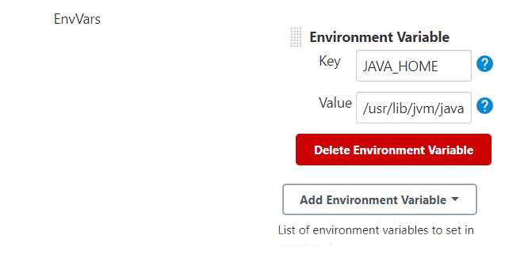
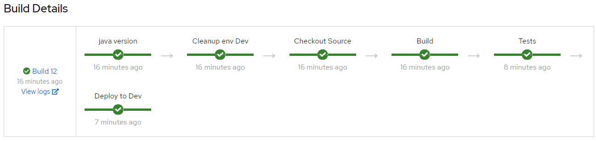

## QuarkusアプリケーションのCI/CDパイプライン

当プロジェクトのQuarkusアプリケーションにおけるビルド・テスト・デプロイを自動化するためのCI/CDパイプラインの構築例を示します。

環境については、パイプラインおよびデプロイ先のアプリケーション実行環境にOpenShift4のクラスターを使用し、その上でJenkinsを使用してパイプラインを実行します。


---
### 準備

事前にいくつかの設定変更やコード修正を行います。

QuarkusのOpenShift拡張を追加します。
```
$ mvn quarkus:add-extensions -Dextensions="openshift" 
[INFO] Scanning for projects...
[INFO] 
[INFO] ------------------------< com.example:testapp >-------------------------
[INFO] Building testapp 1.0-SNAPSHOT
[INFO] --------------------------------[ jar ]---------------------------------
[INFO]
[INFO] --- quarkus-maven-plugin:1.7.5.Final-redhat-00011:add-extensions (default-cli) @ testapp ---
? Extension io.quarkus:quarkus-openshift has been installed
[INFO] ------------------------------------------------------------------------
[INFO] BUILD SUCCESS
[INFO] ------------------------------------------------------------------------
...
```
pom.xmlに依存関係が追加されました。
```xml
    <dependency>
      <groupId>io.quarkus</groupId>
      <artifactId>quarkus-openshift</artifactId>
    </dependency>
```

application.propertiesに以下の設定を追加します。
```properties
%prod.quarkus.kubernetes-client.trust-certs=true
%prod.quarkus.kubernetes.deploy=true
%prod.quarkus.kubernetes.deployment-target=openshift
%prod.quarkus.openshift.expose=true
%prod.quarkus.openshift.image-pull-policy=always
%prod.quarkus.container-image.build=true
%prod.quarkus.openshift.labels.app.openshift.io/runtime=quarkus
%prod.quarkus.s2i.base-jvm-image=registry.access.redhat.com/ubi8/openjdk-11
```

同じくapplication.propertiesのDB接続URLの設定を以下のように変更します。
```properties
%test.quarkus.datasource.db-kind=postgresql
%test.quarkus.datasource.jdbc.url=jdbc:postgresql://postgresql/quarkus_test
# %test.quarkus.datasource.jdbc.url=jdbc:postgresql://localhost/quarkus_test
%test.quarkus.datasource.jdbc.driver=org.postgresql.Driver
%prod.quarkus.datasource.db-kind=postgresql
%prod.quarkus.datasource.jdbc.url=jdbc:postgresql://postgresql/quarkus_test
# %prod.quarkus.datasource.jdbc.url=jdbc:postgresql://localhost/quarkus_test
%prod.quarkus.datasource.jdbc.driver=org.postgresql.Driver
```

`FruitEndpointTest`の`@QuarkusTestResource`をコメントアウトして無効化します。
```java
@QuarkusTest
// @QuarkusTestResource(TestDatabase.class)
@Tag("integration")
public class FruitsEndpointTest {
...
```
### パイプラインの作成

Jenkinsfileを作成します。  
（このJenkinsfileは常に`master`ブランチに対して処理を行います）
- [Jenkinsfile](./Jenkinsfile)


OpenShiftのクラスターにログインして、Projectを作成します。
今回はdevプロジェクトとします。
```
$ oc new-project dev
```
Jenkinsをクラスターにデプロイします。  
（以下はEphemeral版ですが設定等永続化する場合はPersistent版を使用してください）
```
$ oc new-app jenkins-ephemeral
--> Deploying template "openshift/jenkins-ephemeral" to project dev2

     Jenkins (Ephemeral)
     ---------
     Jenkins service, without persistent storage.
     
     WARNING: Any data stored will be lost upon pod destruction. Only use this template for testing.

     A Jenkins service has been created in your project.  Log into Jenkins with your OpenShift account.  The tutorial at https://github.com/openshift/origin/blob/master/examples/jenkins/README.md contains more information about using this template.

     * With parameters:
        * Jenkins Service Name=jenkins
        * Jenkins JNLP Service Name=jenkins-jnlp
        * Enable OAuth in Jenkins=true
        * Memory Limit=1Gi
        * Jenkins ImageStream Namespace=openshift
        * Disable memory intensive administrative monitors=false
        * Jenkins ImageStreamTag=jenkins:2
        * Allows use of Jenkins Update Center repository with invalid SSL certificate=false

--> Creating resources ...
    route.route.openshift.io "jenkins" created
    configmap "jenkins-trusted-ca-bundle" created
    deploymentconfig.apps.openshift.io "jenkins" created
    serviceaccount "jenkins" created
    rolebinding.authorization.openshift.io "jenkins_edit" created
    service "jenkins-jnlp" created
    service "jenkins" created
--> Success
...
```

ビルド・実行にJava11を使用している場合はJenkinsの設定画面からJenkins-AgentのMavenコンテナの環境変数JAVA_HOMEにJava11のパスを指定してください。  



### パイプラインの実行

Jenkinsパイプライン用のBuildConfigを作成します。  
作成が完了すると自動でパイプラインBuildが起動します。
```
$ oc new-build --name=testapp-pipeline --strategy=pipeline https://github.com/rhnkoike/testapp.git
    * A pipeline build using source code from https://github.com/rhnkoike/testapp.git will be created
      * Use 'oc start-build' to trigger a new build

--> Creating resources with label build=testapp-pipeline ...
    buildconfig.build.openshift.io "testapp-pipeline" created
--> Success
```
2回目以降のビルドを手動実行する場合は、以下のコマンドで実行できます。
```
$ oc start-build testapp-pipeline
build.build.openshift.io/testapp-pipeline-xx started
```
GitリポジトリへのPushをトリガーに自動実行する場合は、BuildConfigのWebhook URLをGithubのWebhookを作成して設定することで可能になります。

ビルドが成功するとOpenShiftのWebコンソール等で確認できます。


`View logs`リンクからJenkinsのコンソールを起動してログを確認できます。
```
...
[INFO] 
[INFO] -------------------------------------------------------
[INFO]  T E S T S
[INFO] -------------------------------------------------------
[ERROR] /bin/sh: warning: setlocale: LC_ALL: cannot change locale (en_US.UTF-8)
[INFO] Running com.example.sampleapp.rest.HelloResourceTest
2021-01-06 08:22:22,010 INFO  [org.ecl.jet.uti.log] (main) Logging initialized @4316ms to org.eclipse.jetty.util.log.Slf4jLog
2021-01-06 08:22:22,031 WARN  [org.ecl.jet.ser.AbstractConnector] (main) Acceptors should be <= availableProcessors: NetworkTrafficServerConnector@2904d889{HTTP/1.1,[http/1.1]}{0.0.0.0:0}
2021-01-06 08:22:22,084 INFO  [org.ecl.jet.ser.Server] (main) jetty-9.4.18.v20190429; built: 2019-04-29T20:42:08.989Z; git: e1bc35120a6617ee3df052294e433f3a25ce7097; jvm 11.0.9+11-LTS
2021-01-06 08:22:22,097 INFO  [org.ecl.jet.ser.han.ContextHandler] (main) Started o.e.j.s.ServletContextHandler@7f37a1b9{/__admin,null,AVAILABLE}
2021-01-06 08:22:22,100 INFO  [org.ecl.jet.ser.han.ContextHandler] (main) Started o.e.j.s.ServletContextHandler@6be88640{/,null,AVAILABLE}
2021-01-06 08:22:22,119 INFO  [org.ecl.jet.ser.AbstractConnector] (main) Started NetworkTrafficServerConnector@2904d889{HTTP/1.1,[http/1.1]}{0.0.0.0:8080}
2021-01-06 08:22:22,119 INFO  [org.ecl.jet.ser.Server] (main) Started @4426ms
2021-01-06 08:22:22,378 INFO  [org.ecl.jet.ser.han.Con.__admin] (qtp944055223-59) RequestHandlerClass from context returned com.github.tomakehurst.wiremock.http.AdminRequestHandler. Normalized mapped under returned 'null'
2021-01-06 08:22:23,988 INFO  [io.quarkus] (main) Quarkus 1.7.5.Final-redhat-00011 on JVM started in 3.626s. Listening on: http://0.0.0.0:8081
2021-01-06 08:22:23,989 INFO  [io.quarkus] (main) Profile test activated. 
2021-01-06 08:22:23,989 INFO  [io.quarkus] (main) Installed features: [agroal, cdi, hibernate-orm, jdbc-h2, jdbc-postgresql, kubernetes, mutiny, narayana-jta, rest-client, resteasy, resteasy-jackson, resteasy-jsonb, smallrye-context-propagation]
...
[INFO] Tests run: 5, Failures: 0, Errors: 0, Skipped: 0, Time elapsed: 7.284 s - in com.example.sampleapp.rest.HelloResourceTest
[INFO] Running com.example.sampleapp.rest.FruitsEndpointTest
[INFO] Tests run: 2, Failures: 0, Errors: 0, Skipped: 0, Time elapsed: 0.625 s - in com.example.sampleapp.rest.FruitsEndpointTest
[INFO] Running com.example.sampleapp.rest.GreetingResourceTest
service is RESTEASY004635: Resteasy Client Proxy for : com.example.sampleapp.rest.GreetingService
2021-01-06 08:22:26,175 INFO  [org.ecl.jet.ser.han.Con.ROOT] (qtp944055223-52) RequestHandlerClass from context returned com.github.tomakehurst.wiremock.http.StubRequestHandler. Normalized mapped under returned 'null'
...
[INFO] Tests run: 1, Failures: 0, Errors: 0, Skipped: 0, Time elapsed: 0.072 s - in com.example.sampleapp.rest.GreetingResourceTest
2021-01-06 08:22:26,214 INFO  [io.quarkus] (main) Quarkus stopped in 0.020s
[INFO] 
[INFO] Results:
[INFO] 
[INFO] Tests run: 8, Failures: 0, Errors: 0, Skipped: 0
[INFO] 
[INFO] ------------------------------------------------------------------------
[INFO] BUILD SUCCESS
[INFO] ------------------------------------------------------------------------
...
```
テストが通っていることも確認できました。


